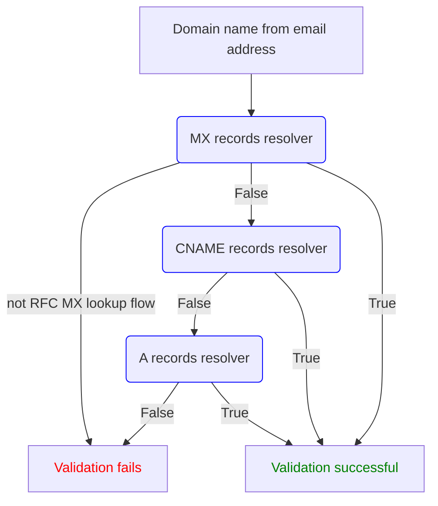
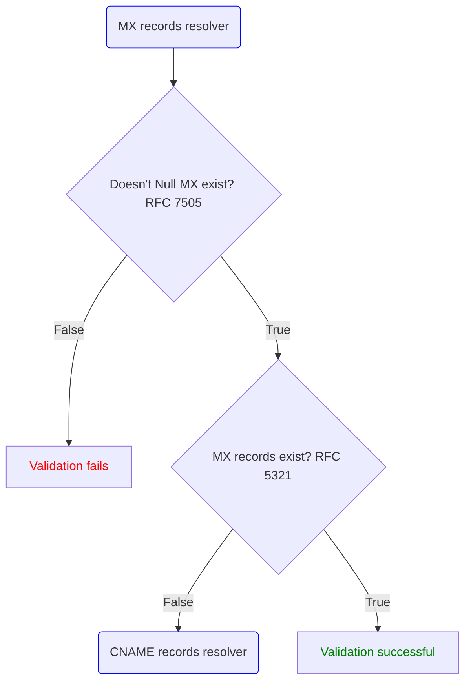
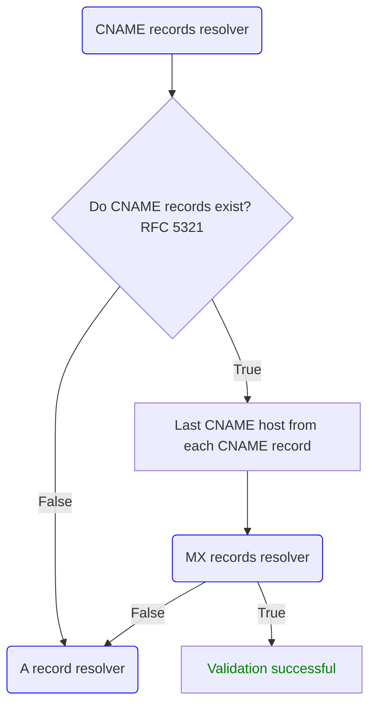
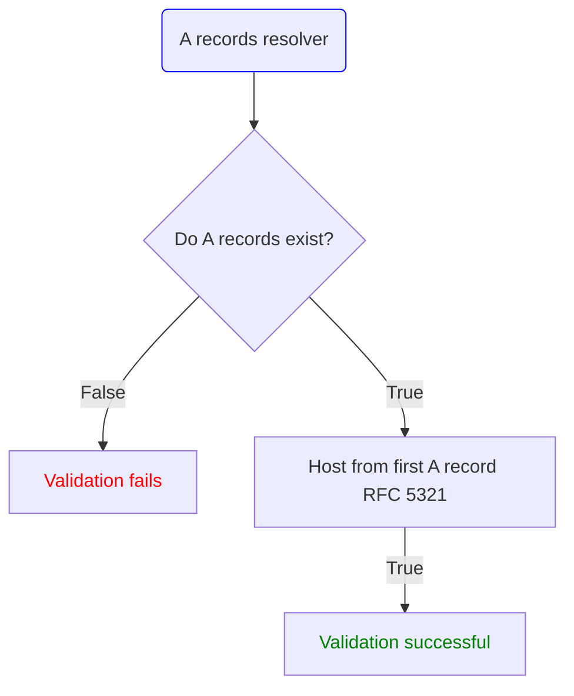

# Architecture

Truemail is a multi-layered email validator/verifier with configurable behavior for specified domain names/mx server ip addresses. So you can validate only what you need.

## DNS (MX) validator

### DNS (MX) validator - step 1, MX records resolver

### DNS (MX) validator - step 2, CNAME records resolver

### DNS (MX) validator - step 3, A records resolver

