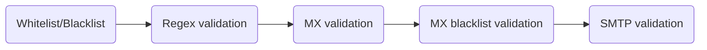
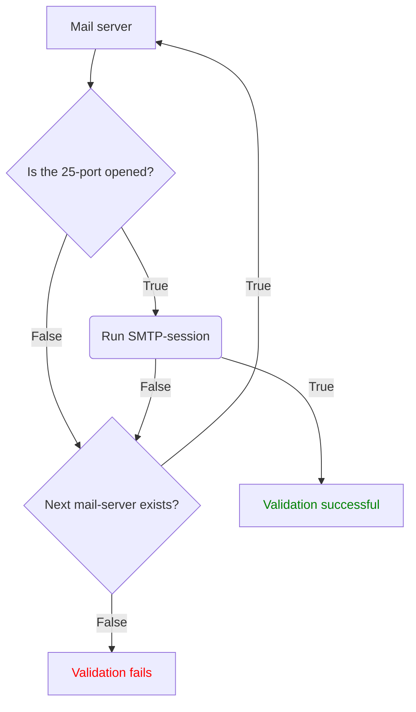
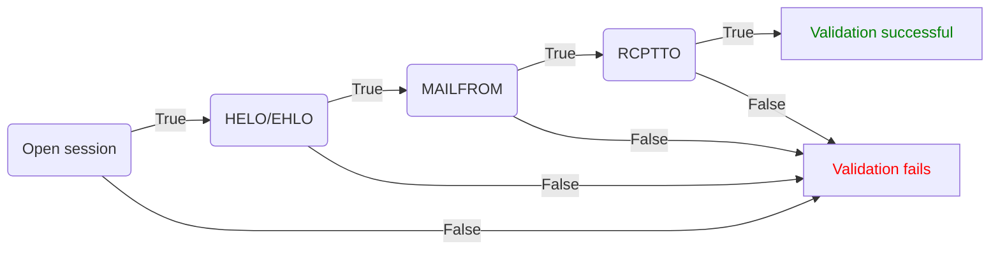

# Architecture

Truemail is a multi-layered email validator/verifier with configurable behavior for specified domain names/mx server ip addresses. So you can validate only what you need.

## DNS validation flow

## MX records resolver

## CNAME records resolver

## A records resolver

## SMTP validation flow

## SMTP-session

