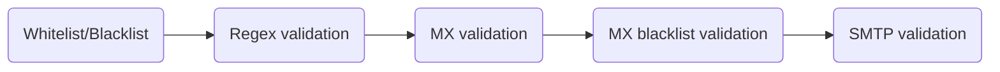
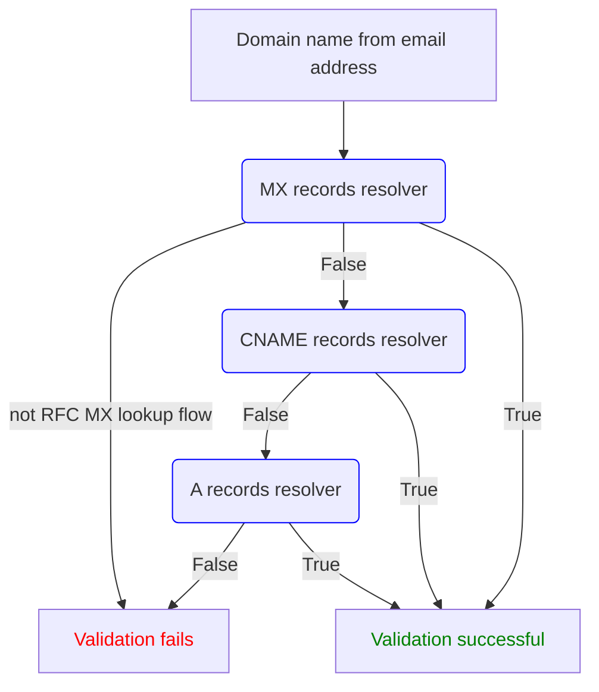
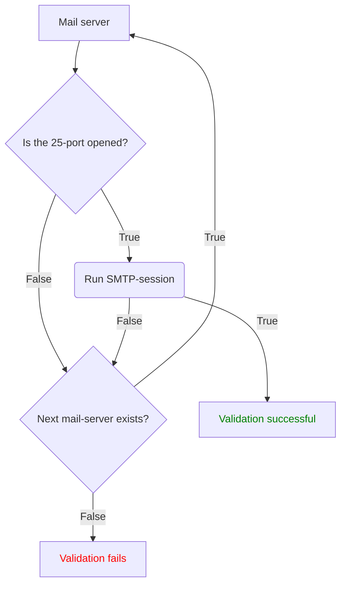

# Validation's layers

Truemail is a multi-layered email validator/verifier with configurable behavior for specified domain names/mx server ip addresses. So you can validate only what you need.



## Whitelist/Blacklist check

Whitelist/Blacklist check is zero validation level. You can define white and black list domains. It means that validation of email which contains whitelisted domain always will return `true`, and for blacklisted domain will return `false`.

Please note, other validations will not processed even if it was defined in `ValidationTypeByDomain`.

**Sequence of domain list check:**

1. Whitelist check
2. Whitelist validation check
3. Blacklist check

Example of usage:

```go
import "github.com/truemail-rb/truemail-go"

configuration := truemail.NewConfiguration(
  truemail.ConfigurationAttr{
    VerifierEmail: "verifier@example.com",
    WhitelistedDomains: []string{"white-domain.com", "somedomain.com"},
    BlacklistedDomains: []string{"black-domain.com", "somedomain.com"},
    ValidationTypeByDomain: map[string]string{"somedomain.com": "mx"},
  },
)
```

### Whitelist case

When email in whitelist, validation type will be redefined. Validation result returns ```true```

```go
import "github.com/truemail-rb/truemail-go"

configuration := truemail.NewConfiguration(
  truemail.ConfigurationAttr{
    VerifierEmail: "verifier@example.com",
    WhitelistedDomains: []string{"white-domain.com", "somedomain.com"},
    BlacklistedDomains: []string{"black-domain.com", "somedomain.com"},
    ValidationTypeByDomain: map[string]string{"somedomain.com": "mx"},
  },
)

truemail.Validate("email@white-domain.com", configuration) // returns pointer to validatorResult with validation details and error
truemail.IsValid("email@white-domain.com", configuration) // returns true
```

### Whitelist validation case

When email domain in whitelist and `WhitelistValidation` is sets equal to `true` validation type will be passed to other validators. Validation of email which not contains whitelisted domain always will return `false`.

#### Email has whitelisted domain

```go
import "github.com/truemail-rb/truemail-go"

configuration := truemail.NewConfiguration(
  truemail.ConfigurationAttr{
    VerifierEmail: "verifier@example.com",
    WhitelistedDomains: []string{"white-domain.com"},
    WhitelistValidation: true,
  },
)

truemail.Validate("email@white-domain.com", configuration, "regex") // returns pointer to validatorResult with validation details and error
truemail.IsValid("email@white-domain.com", configuration, "regex") // returns true
```

#### Email hasn't whitelisted domain

```go
import "github.com/truemail-rb/truemail-go"

configuration := truemail.NewConfiguration(
  truemail.ConfigurationAttr{
    VerifierEmail: "verifier@example.com",
    WhitelistedDomains: []string{"white-domain.com"},
    WhitelistValidation: true,
  },
)

truemail.Validate("email@domain.com", configuration, "regex") // returns pointer to validatorResult with validation details and error
truemail.IsValid("email@domain.com", configuration, "regex") // returns false
```

### Blacklist case

When email in blacklist, validation type will be redefined too. Validation result returns `false`.

```go
import "github.com/truemail-rb/truemail-go"

configuration := truemail.NewConfiguration(
  truemail.ConfigurationAttr{
    VerifierEmail: "verifier@example.com",
    WhitelistedDomains: []string{"white-domain.com", "somedomain.com"},
    BlacklistedDomains: []string{"black-domain.com", "somedomain.com"},
    ValidationTypeByDomain: map[string]string{"somedomain.com": "mx"},
  },
)

truemail.Validate("email@black-domain.com", configuration) // returns pointer to validatorResult with validation details and error
truemail.IsValid("email@domain.com", configuration) // returns false
```

### Duplication case

Validation result for this email returns `true`, because it was found in whitelisted domains list first. Also `validatorResult.ValidationType` for this case will be redefined.

```go
import "github.com/truemail-rb/truemail-go"

configuration := truemail.NewConfiguration(
  truemail.ConfigurationAttr{
    VerifierEmail: "verifier@example.com",
    WhitelistedDomains: []string{"white-domain.com", "somedomain.com"},
    BlacklistedDomains: []string{"black-domain.com", "somedomain.com"},
    ValidationTypeByDomain: map[string]string{"somedomain.com": "mx"},
  },
)

truemail.Validate("email@somedomain.com", configuration) // returns pointer to validatorResult with validation details and error
truemail.IsValid("email@somedomain.com", configuration) // returns true
```

## Regex validation

Validation with regex pattern is the first validation level. It uses whitelist/blacklist check before running itself.

> [[Whitelist/Blacklist]](validations-layers?id=whitelistblacklist-check) -> [Regex validation]

By default this validation not performs strictly following [RFC 5322](https://www.ietf.org/rfc/rfc5322.txt) standard, so you can override Truemail default regex pattern if you want. Example of usage:

### With default regex pattern

```go
import "github.com/truemail-rb/truemail-go"

configuration := truemail.NewConfiguration(
  truemail.ConfigurationAttr{
    VerifierEmail: "verifier@example.com",
  },
)

truemail.Validate("email@example.com", configuration, "regex") // returns pointer to validatorResult with validation details and error
truemail.IsValid("email@example.com", configuration, "regex") // returns true
```

### With custom regex pattern

You should define your custom regex pattern in a configuration before.

```go
import "github.com/truemail-rb/truemail-go"

configuration := truemail.NewConfiguration(
  truemail.ConfigurationAttr{
    VerifierEmail: "verifier@example.com",
    EmailPattern: `\A(.+)@(.+)\z`,
  },
)

truemail.Validate("email@example.com", configuration, "regex") // returns pointer to validatorResult with validation details and error
truemail.IsValid("email@example.com", configuration, "regex") // returns true
truemail.IsValid("not_email", configuration, "regex") // returns false
```

## MX validation

In fact it's DNS validation because it checks not MX records only. DNS validation is the second validation level, historically named as MX validation. It uses [Regex validation](validations-layers?id=regex-validation) before running itself. When regex validation has completed successfully then runs itself.

> [[Whitelist/Blacklist]](validations-layers?id=whitelistblacklist-check) -> [[Regex validation]](validations-layers?id=regex-validation) -> [MX validation]

Please note, Truemail MX validator [not performs](https://github.com/truemail-rb/truemail/issues/26) strict compliance of the [RFC 5321](https://tools.ietf.org/html/rfc5321#section-5) standard for the best validation outcome.



### RFC MX lookup flow

[Truemail MX lookup](https://slides.com/vladislavtrotsenko/truemail#/0/9) based on RFC 5321. It consists of 3 substeps: `MX`, `CNAME` and `A` record resolvers. The point of each resolver is attempt to extract the mail servers from email domain. If at least one server exists that validation is successful. Iteration is processing until resolver returns `true`. Example of usage:

```go
import "github.com/truemail-rb/truemail-go"

configuration := truemail.NewConfiguration(
  truemail.ConfigurationAttr{
    VerifierEmail: "verifier@example.com",
  },
)

truemail.Validate("email@example.com", configuration, "mx") // returns pointer to validatorResult with validation details and error
truemail.IsValid("email@example.com", configuration, "mx") // returns bool
```

### Not RFC MX lookup flow

Also Truemail has possibility to use not RFC MX lookup flow. It means that will be used only one MX resolver on the DNS validation layer. By default this option is disabled. Example of usage:

```go
import "github.com/truemail-rb/truemail-go"

configuration := truemail.NewConfiguration(
  truemail.ConfigurationAttr{
    VerifierEmail: "verifier@example.com",
    NotRfcMxLookupFlow: true,
  },
)

truemail.Validate("email@example.com", configuration, "mx") // returns pointer to validatorResult with validation details and error
truemail.IsValid("email@example.com", configuration, "mx") // returns bool
```

## MX blacklist validation

MX blacklist validation is the third validation level. This layer provides checking extracted mail server(s) IP address from MX validation with predefined blacklisted IP addresses list. It can be used as a part of DEA ([disposable email address](https://en.wikipedia.org/wiki/Disposable_email_address)) validations.

> [[Whitelist/Blacklist]](validations-layers?id=whitelistblacklist-check) -> [[Regex validation]](validations-layers?id=regex-validation) -> [[MX validation](validations-layers?id=mx-validation)] -> [MX blacklist validation]

Example of usage:

```go
import "github.com/truemail-rb/truemail-go"

configuration := truemail.NewConfiguration(
  truemail.ConfigurationAttr{
    VerifierEmail: "verifier@example.com",
    BlacklistedMxIpAddresses: []string{"127.0.1.2", "127.0.1.3"},
  },
)

truemail.Validate("email@example.com", configuration, "mx_blacklist") // returns pointer to validatorResult with validation details and error
truemail.IsValid("email@example.com", configuration, "mx_blacklist") // returns bool
```

## SMTP validation

SMTP validation is a final, fourth validation level. This type of validation tries to check real existence of email account on a current email server. This validation runs a chain of previous validations and if they're complete successfully then runs itself.

> [[Whitelist/Blacklist]](validations-layers?id=whitelistblacklist-check) -> [[Regex validation]](validations-layers?id=regex-validation) -> [[MX validation]](validations-layers?id=mx-validation) -> [[MX blacklist validation]](validations-layers?id=mx-blacklist-validation) -> [SMTP validation]

If total count of MX servers is equal to one, `truemail` SMTP validator will use value from `ConnectionAttempts` as connection attempts. By default it's equal `2`.

?> You should follow [verifier host preconditions rules](quick-start?id=verifier-host-preconditions) for the best email SMTP validation outcome if you going to use this validation layer. Also you can reduce time of SMTP validation by enabling SMTP fail fast behaviour.



By default, you don't need pass with-parameter to use it. Example of usage is specified below:

### SMTP fail fast enabled

Truemail can use fail fast behaviour for SMTP validation layer. When `SmtpFailFast = true` it means that `truemail` ends smtp validation session after first attempt on the first mx server in any fail cases (network connection/timeout error, smtp validation error). This feature helps to reduce total time of SMTP validation session up to 1 second.

```go
import "github.com/truemail-rb/truemail-go"

configuration := truemail.NewConfiguration(
  truemail.ConfigurationAttr{
    VerifierEmail: "verifier@example.com",
    SmtpFailFast: true,
  },
)

truemail.Validate("email@example.com", configuration) // returns pointer to validatorResult with validation details and error
truemail.IsValid("email@example.com", configuration) // returns bool
```

### SMTP safe check disabled

When this feature disabled, it means that SMTP validation will be failed when it consists at least one smtp error.

```go
import "github.com/truemail-rb/truemail-go"

configuration := truemail.NewConfiguration(
  truemail.ConfigurationAttr{
    VerifierEmail: "verifier@example.com",
  },
)

truemail.Validate("email@example.com", configuration) // returns pointer to validatorResult with validation details and error
truemail.IsValid("email@example.com", configuration) // returns bool
```

### SMTP safe check enabled

When this feature enabled, it means that SMTP validation will be successful for all cases until `truemail` SMTP validator receive `RCPT TO` error that matches to `SmtpErrorBodyPattern`, specified in `configuration`.

```go
import "github.com/truemail-rb/truemail-go"

configuration := truemail.NewConfiguration(
  truemail.ConfigurationAttr{
    VerifierEmail: "verifier@example.com",
    SmtpSafeCheck: true,
  },
)

truemail.Validate("email@example.com", configuration) // returns pointer to validatorResult with validation details and error
truemail.IsValid("email@example.com", configuration) // returns bool
```
